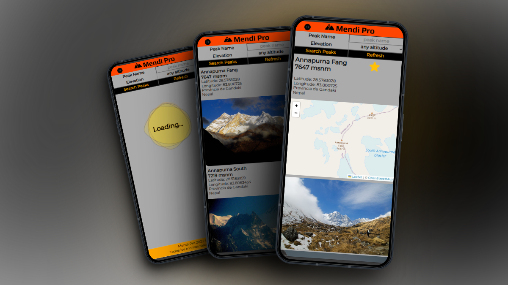

## MENDI PRO

25 de octubre de 2023, 19:58.
Página desplegada en GitHub Pages: [MendiPro](https://alexbasurto.github.io/mendi_pro/)

WebApp de consulta de cimas a nivel mundial: búsqueda por nombre de la cima y por altura de la misma.

La página ofrece una serie de resultados coincidentes con los criterios de búsqueda, con la siguiente información por registro:
- nombre de la cima
- altura
- coordenadas
- ubicación (municipio, región...)
- foto de cabecera

Si entramos en uno de los resultados, la información es ampliada:
- Mapa de la zona
- 4 fotos
- Pronostico detallado del tiempo para los próximos 7 días
- Climatología actual

## Requisitos mínimos del proyecto

- Empleo de HTML y CSS plano, y JS Vanilla.
- JS: empleo del DOM.
- Llamada a una API.

## APIs empleadas
- OverPassApi.de (OpenStreetMap):
    - Búsqueda de cimas.
    - Detalle de cima.

- Nominatim (OpenStreetMap):
    - Info de la ubicación (municipio, región...).

- Flickr:
    - Carga de imágenes a partir del nombre de la cima.

- Open-Meteo.com
    - Pronóstico próximos 7 días.
    - Tiempo actual.

## Librerías utilizadas

Leaflet JS: https://leafletjs.com/examples/quick-start/